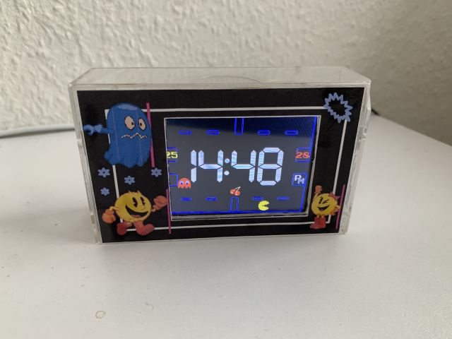
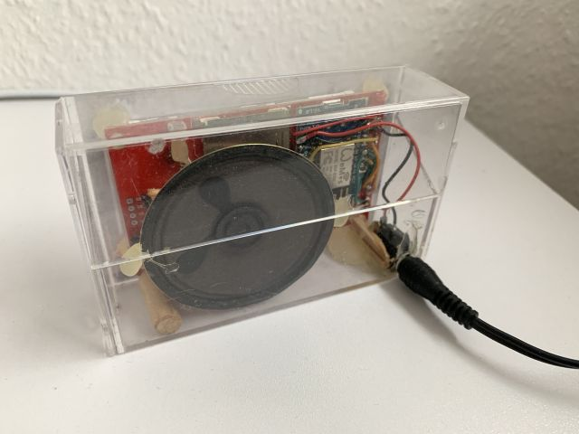

# ESP8266 based alarm clock with Pac-Man theme.

This is a fork of the famous [Pac-Man clock](https://www.instructables.com/Retro-Pac-Man-Clock/) featured at [Instructables](https://www.instructables.com/). It is based on Version 8 with these changes:

- ported to esp8266/TFT_eSPI/XPT2046
- replaced RTC with NTP
- using original pac-man font and original images for pacman, ghosts and fruit (extracted from arcade_gfx.png using some Python code)
- ghost and pacman can move through side doors
- more accurate time display (no dependencies to delay()s)
- play several wakeup tunes, including rttl pacman song (via tone())
- read alarm and time settings on every fresh start
- don't switch off alarm flag after alarm rings and user switched off
- real "cancel" functionality on setup dialog
- display (and toggling) current time and date on setup dialog when tapped in top area
- ghost has a running animation
- choose ghost (Blinky, Pinky, Inky, Clyde) on setup dialog
- showing a bell icon if alarm is set which flashes on alarm
- using defines for rows and columns, easier to port to bigger displays
- improved Pac-Man control via touch panel: direction taps will be used on next section and cleared, you can actually *play*!
- control background light of display via ambient light sensor with smooth transitions
- some code cleanups

released: 2017-05-02

May 2025:
- ported to CYD including changes for library advancements

my alarm clock running for years now on my bedside table:

